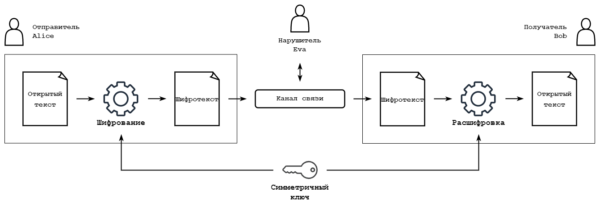
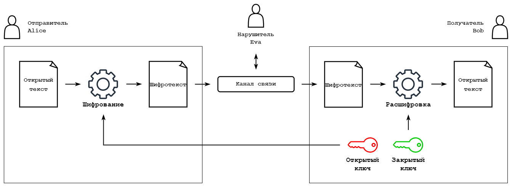
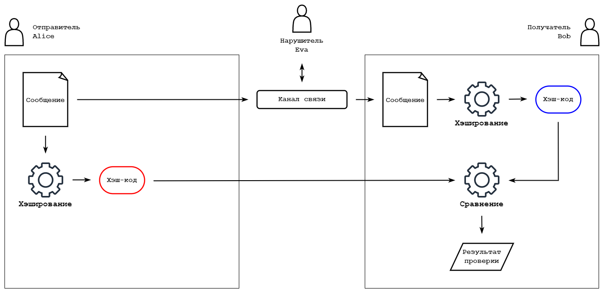

# 1. Введение в криптографию

**Криптография** – наука, занимающаяся разработкой методов преобразований информации с целью её защиты. 

Криптография нацелена на обеспечение:
- конфиденциальности (невозможность прочтения информации посторонними);
- целостности данных (невозможность незаметного изменения информации);
- аутентификации (контроль подлинности авторства).

Для обеспечения конфиденциальности данных применяют различные алгоритмы шифрования. **Шифрование** – это некоторое криптографическое преобразование **открытого текста** (исходные незашифрованные (не обязательно текстовые) данные) в **шифротекст** (зашифрованные данные). Соответственно, процесс, обратный шифрованию, называется **расшифровка**.

Все алгоритмы шифрования делятся на две большие категории: **симметричные** и **ассиметричные**.

[Задание](./test1)

В симметричных криптосистемах отправитель («абонент A» или «Alice») шифрует свой открытый текст, посылает его получателю («абонент B» или «Bob»), который расшифровывает его тем же ключом. Нарушитель («абонент E» или «Eva») воздействует на канал связи в попытках взломать шифр.

В асимметричных криптосистемах получатель генерирует пару из открытого и закрытого ключа, отправляет другой стороне открытый ключ, с помощью которого отправитель шифрует свой открытый текст. Получатель расшифровывает шифротекст с помощью закрытого ключа. 

Для использования асимметричного шифрования необходимо наличие **односторонней функции с секретом** – такой функции $f_s (x)$, которая удовлетворяет следующим условиям:
- зная $x$, вычислительно легко найти $y = f_s (x)$;
- зная $y$ и секрет $s$, вычислительно легко найти $x = f_s^{-1} (y)$;
- зная $y$, но не зная секрет $s$, вычислительно трудно найти $x = f_s^{-1} (y)$.

[Задание](./test2)

Для контроля целостности данных и подлинности отправителя применяются методы, использующие хэш-функции. **Хэш-функцией** называется такая функция, которая для строки бит произвольной длины вычисляет некоторую другую строку бит фиксированной длины (**хэш-код**).

Общий вид методов контроля целостности данных следующий: отправитель применяет хэш-функцию над сообщением, полученный хэш-код отправляет вместе с сообщением получателю, тот применяет хэш-функцию над сообщением и получает новый хэш-код, который затем сравнивает с полученным от отправителя. Несовпадение хэш-кодов говорит о нарушении целостности сообщения.

