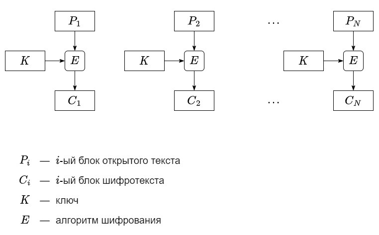
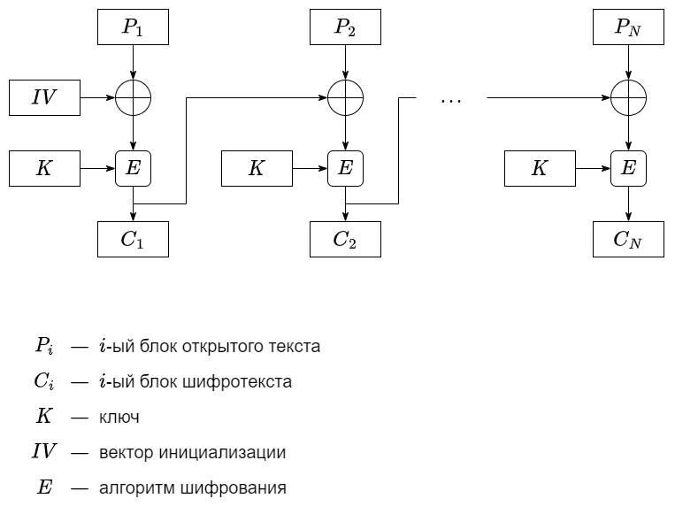

# 3. Симметричное шифрование: блочные алгоритмы

В современной криптографии блочные алгоритмы шифрования являются наиболее распространёнными для шифрования открытого текста. На вход блочного шифра подаются блок $n$ бит и ключ $k$ бит. На выходе блочного шифра блок $n$ бит, причём изменение даже одного бита входного блока значительно меняет выходной блок.

Блочные шифры различаются не только реализацией, но и размерами блока и ключа. Так, например, у алгоритма [DES (Data Encryption Standard)](ru.wikipedia.org/wiki/DES) размер блока $64$ бит, а размер ключа – $56$ бит. Это означает, что алгоритм способен шифровать и расшифровывать сообщения длиной $64$ бит, при этом симметричный ключ должен иметь длину $56$ бит.

Для взлома шифра "грубой силой" (перебор всех ключей) необходимо перебрать $256$ значений ключа. Для увеличения криптостойкости (сложности подбора ключа) был придуман алгоритм [3DES (Triple DES)](ru.wikipedia.org/wiki/Triple_DES), который применяет алгоритм DES три раза. Существует три типа алгоритма 3DES: 
- DES-EEE3 – операции шифрование-шифрование-шифрование с тремя разными ключами (сложность атаки "грубой силы" – $2168$);
- DES-EDE3 – операции шифрование-расшифровка-шифрование с тремя разными ключами (сложность атаки "грубой силы" – $2168$);
- DES-EEE2 – операции шифрование-шифрование-шифрование с одинаковыми ключами на первом и третьем шаге (сложность атаки "грубой силы" – $2112$);
- DES-EDE2 – операции шифрование-расшифровка-шифрование с одинаковыми ключами на первом и третьем шаге (сложность атаки "грубой силы" – $2112$).

Принципиально другим алгоритмом является [AES (Advanced Encryption Standard)](https://ru.wikipedia.org/wiki/AES_(стандарт_шифрования)). Размер блока данного алгоритма составляет $128$ бит, ключ может иметь размеры $128$, $192$ или $256$ бит.

Как уже было сказано ранее, блочные шифры принимают на вход блок фиксированной длины. Однако передаваемая информация зачастую превышает эту длину. Для использования блочных алгоритмов шифрования используются различные [**режимы шифрования**](https://ru.wikipedia.org/wiki/Режим_шифрования). Рассмотрим пару режимов.

В режиме **электронной кодовой книги (ECB)** открытый текст разбивается на блоки длины $n$ (последний блок по необходимости дополняется, например, одной "$1$" и последующими "$0$"), после чего каждый блок шифруется независимо друг от друга. Плюс данного режима – возможность распараллелить шифрование. Минус – одинаковые блоки открытого текста преобразуются в одинаковые блоки шифротекста.



В режиме **сцепления блоков шифротекста (CBC)** открытый текст разбивается на блоки длины $n$ (последний блок по необходимости дополняется), после чего шифруется значение операции исключающего ИЛИ (XOR) блока открытого текста $P_i$ и предыдущего блока шифротекста $C_{i - 1}$ (для $P_1$ берётся вектор инициализации $IV$ – случайное число): $P_i \oplus C_{i - 1}$. Распараллелить шифрование в данном режиме невозможно, однако расшифровка поддаётся распараллеливанию. Из достоинств режима можно отметить различные результаты шифрования одинаковых блоков открытого текста.



Почему преобразование одинаковых блоков открытого текста в одинаковые блоки шифротекста – плохо? Для ответа на этот вопрос зашифруем изображение алгоритмом DES в режимах ECB и CBC. Как можно заметить, шифротекст в режиме ECB по-прежнему читаем, что не позволяет достичь необходимого уровня конфиденциальности.


||||
|---|---|---|

Реализация алгоритмов в данном курсе не рассматривается ввиду их обширности. Для использования в практических целях рекомендуем использовать модуль [`PyCryptodome`](https://pycryptodome.readthedocs.io/en/latest/). Для установки можно воспользоваться командой `pip install pycryptodome`. В качестве примера использования данного модуля рассмотрим следующий код:

```python
from Crypto.Cipher import DES
from Crypto.Uti.Padding import pad, unpad


BLOCK_SIZE = 8

key = b'12345678'
cipher = DES.new(key, DES.MODE_ECB)
plaintext = b'Python'
ciphertext = cipher.encrypt(pad(plaintext, BLOCK_SIZE))
print(ciphertext)
plaintext = unpad(cipher.decrypt(ciphertext), BLOCK_SIZE)
print(plaintext.decode('utf-8'))

```

Функции из `PyCryptodome` оперируют с байтами. Чтобы строку представить в виде набора байт, достаточно поставить перед кавычкой `b`. Такая запись позволит интерпретатору работать со строкой, как с байтами.

Алгоритмы шифрования лежат в модуле `Crypto.Cipher`. В данном примере импортируем оттуда алгоритм `DES`. Для использования алгоритма необходимо создать объект с помощью метода `DES.new()`. Метод принимает ключ (если длина ключа не будет соответствовать необходимой, метод выбросит ошибку) и режим работы.

Созданный объект `cipher` имеет методы `cipher.encrypt()` для шифрования и `cipher.decrypt()` для расшифровки. Поскольку открытый текст может не быть кратен размеру одного блока, то необходимо расширить последний блок. Для этого существуют функции `pad()` для расширения и `unpad()` для отсечения лишних бит из модуля `Crypto.Util.Padding`.

Результатом расшифровки, как и шифрования, является набор байт. Однако, есть способ конвертировать байты в строку. Для этого необходимо вызвать метод `decode(‘utf-8’)`.
