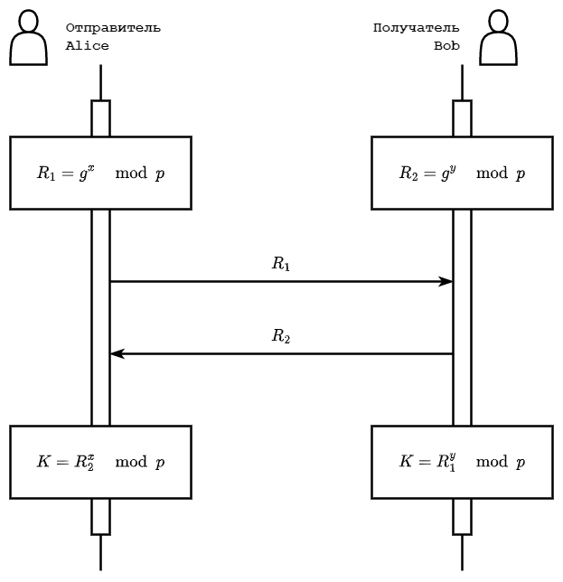
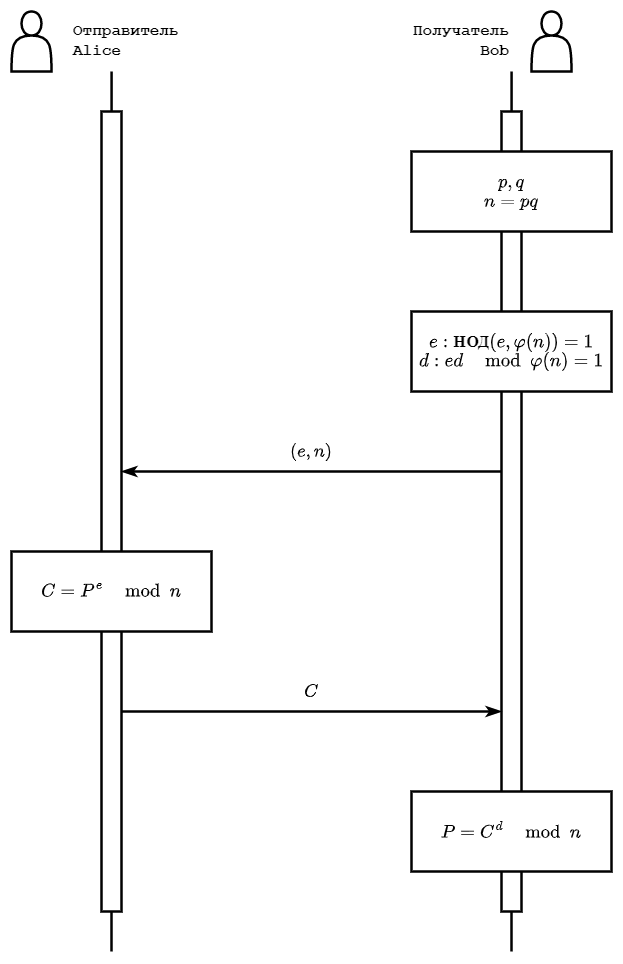

# 4. Асимметричное шифрование

Существенным недостатком рассматриваемых ранее алгоритмов – сложность в обмене ключом. Поскольку ключ шифрования и расшифровки одинаковый, необходимо создать условия, при которых ключом будут владеть только отправитель и получатель. 

Одним из решений поставленной задачи является протокол [**Диффи–Хеллмана**](https://ru.wikipedia.org/wiki/Протокол_Диффи_—_Хеллмана). Суть протокола заключается в создании некоего материала обеими сторонами, который в последующем можно преобразовать в симметричный ключ.

Перед рассмотрением протокола Диффи–Хеллмана необходимо ознакомиться с понятием [**первообразный корень**](https://ru.wikipedia.org/wiki/Первообразный_корень_(теория_чисел)). Первообразным корнем по модулю $m$ называется такое целое число $g$, что $g^{\varphi (m)} \equiv 1 \mod m$ и $g^l \not\equiv 1 \mod m$ при $1 \leq l < \varphi (m)$, где $\varphi (m)$ – [**функция Эйлера**](https://ru.wikipedia.org/wiki/Функция_Эйлера). Значение функции Эйлера для числа $n$ равно количеству натуральных чисел $N_i$, таких, что $N_i \leq n$ и $\text{НОД}(N_i, n) = 1$. Для числа $m = p_1^{a_1} \cdot p_2^{a_2} \cdot \ldots \cdot p_n^{a_n}$, где $p_1$, $p_2$, $...$, $p_n$ – простые числа, функция Эйлера равна
$$\varphi (m) = m \prod_{i = 1}^{n} \left( 1 - \dfrac{1}{p_i} \right) = \prod_{i = 1}^{n} \left( p_i^{a_i} - p_i^{a_i - 1} \right).$$
Вычислить функцию Эйлера можно, зная его свойства: 
- если $p$ – простое число, то $\varphi (p) = p - 1$;
- если $p$ и $q$ – взаимно простые числа, то $\varphi (pq) = \varphi (p) \varphi (q)$.

Так, например, для числа $m = 10$ функция Эйлера равна $\varphi (10) = \varphi (2) \cdot \varphi (5) = 1 \cdot 4 = 4$. Соответственно, первообразным корнем будет являться такое число $g$, что $g \not\equiv 1 \mod 10$, $g^2 \not\equiv 1 \mod 10$, $g^3 \not\equiv 1 \mod 10$ и $g^4 \equiv 1 \mod 10$. Найдём такое число:

| $g$ | $g \mod 10$ | $g^2 \mod 10$ | $g^3 \mod 10$ | $g^4 \mod 10$ |
|-----|-----|-----|-----|-----|
| 1 | 1 | 1 | 1 | 1 |
| 2 | 2 | 4 | 8 | 6 |
| 3 | 3 | 9 | 7 | 1 |
| 4 | 4 | 6 | 4 | 6 |
| 5 | 5 | 5 | 5 | 5 |
| 6 | 6 | 6 | 6 | 6 |
| 7 | 7 | 9 | 3 | 1 |
| 8 | 8 | 4 | 2 | 6 |
| 9 | 9 | 1 | 9 | 1 |

Таким образом, первообразными корнями числа $10$ являются числа $3$ и $7$.

Для первообразного корня $g$ значения $g^0 \mod m = g^{\varphi (m)} \mod m = 1$, $g \mod m$, $…$, $g^{\varphi (m) - 1} \mod m$ являются различными числами. Таким образом, для простого числа $p$ первообразный корень $g$ является **генератором** – числом, степени которого образуют все элементы в кольце вычетов по модулю $p$, т.е. с помощью которого можно получить все числа от $1$ до $p - 1$.

Например, для простого числа $5$ генератором является число $2$, так как $2 \mod 5 = 2$, $2^2 \mod 5 = 4$, $2^3 \mod 5 = 3$, $2^4 \mod 5 = 1$.

[Задание](./test1)

[Задание](./test2)

[Задание](./test3)

[Задание](./test4)

Итак, одна из сторон создаёт большое простое число $p$ и некоторое другое простое число $g$, являющееся первообразным корнем по модулю $p$, и отправляет их другой стороне. Числа $p$ и $g$ не являются секретными. После этого каждая сторона создаёт свой собственный секретный ключ $x$ и $y$ соответственно и вычисляет значение выражения $R_1 = g^x \mod p$ и $R_2 = g^y \mod p$. Стороны обмениваются получившимися значениями (таким образом, $R_1$ и $R_2$ также не являются секретными, так как могут быть перехвачены третьей стороной). Затем каждая сторона вычисляет число $K = R_2^x \mod p$ и $K = R_1^y \mod p$. Очевидно, что 
$$R_2^x \mod p = (g^y \mod p)^x \mod p = g^{xy} \mod p$$
и 
$$R_1^y \mod p = (g^x \mod p)^y \mod p = g^{xy} \mod p$$
равны. Число $K$ можно использовать для создания ключа (так как число $K$ может не соответствовать размеру симметричного ключа). При этом, зная числа $p$, $g$, $R_1$ и $R_2$, вычислить $x$, $y$ или $K$ вычислительно трудно.



Ещё одним из решений поставленной выше задачи является асимметричное шифрование. Суть его в том, что шифрование и расшифровка происходит с помощью разных ключей: сообщение шифруется с помощью **открытого** (потенциально известного всем) ключа, а расшифровывается с помощью **закрытого**, известного только получателю.

Самым распространённым асимметричным алгоритмом шифрования является алгоритм [**RSA**](https://ru.wikipedia.org/wiki/RSA). Принимаемая сторона генерирует два больших простых числа $p$ и $q$, вычисляет число $n = p q$ и функцию Эйлера $\varphi (n) = (p - 1) (q - 1)$. Затем необходимо выбрать такое число $e$, которое будет взаимно простым с $\varphi (n)$ ($\text{НОД} (e, \varphi (n)) = 1$), и вычислить число $d$, для которого справедливо выражение $e d \mod \varphi (n) = 1$. Пара чисел $(e, n)$ является открытым ключом и отправляется отправляющей стороне, а число $d$ – закрытым ключом и держится в секрете у принимаемой стороны.

Для шифрования открытого текста $P$ необходимо выполнить следующую операцию: 
$$C = P^e \mod n.$$

Для расшифровки необходимо выполнить следующую операцию: 
$$P = C^d \mod n.$$ 



Зная значения переменных $e$, $n$ и $C$ вычислительно трудно вычислить $P$, поскольку для этого необходимо знать значение переменной $d$, для вычисления которой необходимо знание чисел $p$ и $q$. Задача разложения числа $n$ на простые сомножители $p$ и $q$ называется **задачей факторизации** и является вычислительно трудной.

[Задание](./test5)

[Задание](./test6)

В модуле `PyСryptodome` имеются все необходимые функции для шифрования и расшифровки сообщений с помощью RSA. Рассмотрим генерацию ключей, шифрование с помощью открытого ключа и расшифровку с помощью закрытого.

Генерация ключей:

```python
from Crypto.PublicKey import RSA


key = RSA.generate(1024)
with open('./private_key.pem', 'wb') as file:
    file.write(key.export_key())
with open('./public_key.pem', 'wb') as file:
    file.write(key.public_key().export_key())

```

Генерация ключей происходит с помощью метода `RSA.generate()`, входным параметром которого является длина ключа в битах. Для сохранения ключей в файл необходимо открыть файлы на запись в двоичном режиме. В примере ключи сохраняются в формате PEM. Для записи закрытого ключа используется метод `key.export_key()`, а для открытого – `key.public_key().export_key()`.

Шифрование данных:

```python
from Crypto.Cipher import PKCS1_OAEP
from Crypto.PublicKey import RSA


with open('./public_key.pem', 'rb') as file:
    key = RSA.import_key(file.read())
cipher = PKCS1_OAEP.new(key)
plaintext = b'Python'
ciphertext = cipher.encrypt(plaintext)
with open('./data.bin', 'wb') as file:
    file.write(ciphertext)

```

Для получения ключа из файла используется метод `RSA.import_key()`. Этот метод возвращает открытый ключ, который затем передаётся в метод `PKCS1_OAEP.new()` для получения объекта `cipher`. PKCS1_OAEP является шифром на основе RSA и [OAEP](https://ru.wikipedia.org/wiki/Оптимальное_асимметричное_шифрование_с_дополнением).

Расшифровка данных:

```python
from Crypto.Cipher import PKCS1_OAEP
from Crypto.PublicKey import RSA


with open('./private_key.pem', 'rb') as file:
    key = RSA.import_key(file.read())
cipher = PKCS1_OAEP.new(key)
with open('./data.bin', 'rb') as file:
    ciphertext = file.read()
plaintext = cipher.decrypt(ciphertext)
print(plaintext.decode('utf-8'))

```

## Задачи

[Задача 1](./task1)

[Задача 2](./task2)

[Задача 3](./task3)

[Задача 4](./task4)
