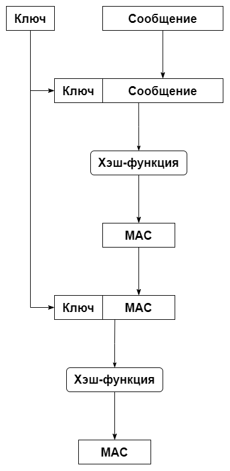

Ещё одним кодом аутентификации является **Nested MAC** (**NMAC**):

Ключ и сообщение конкатенируются, результат хешируется. Результат хеш-функции также конкатенируется с ключом, результат хешируется. Результат является кодом аутентификации.

Пусть ключ и сообщение представляют собой строки произвольной длины. Реализуйте функцию `nmac(key, message)`, принимающую на вход ключ `key` и сообщение `message` и возвращающую NMAC в `bytes`. В качестве хеш-функции примите реализованную нами функцию `h()`.

| Входные данные | Выходные данные |
| --- | --- |
| `nmac(b'1234', b'Test')` | `b'\xc9\xe8s4:\xe3\x0fd\xb3\xe8\xa3\xfd\xf6u\xb0B'` |
| `nmac(b'1234', b'')` | `b'\x05\xba\x9a\x93\x0b\xc6e\x60\xbcq3\x8b\x1a\xe3;I'` |
| `nmac(b'', b'Test')` | `b'\xab\x1c\xe1\xf3\x1ag\xffT$\x91F\xf7\x93\xde\x08\x81'` |
